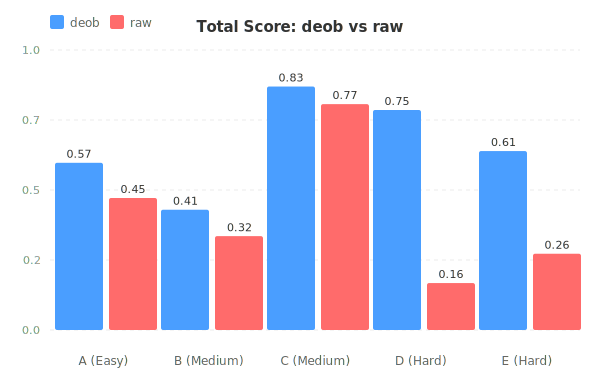
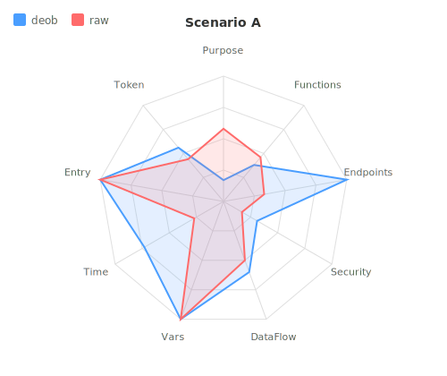
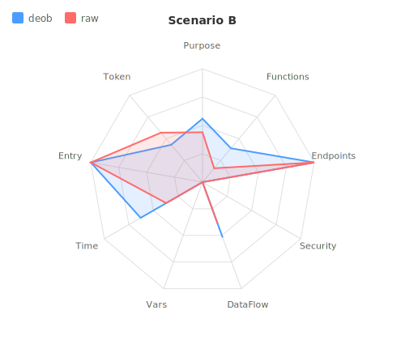
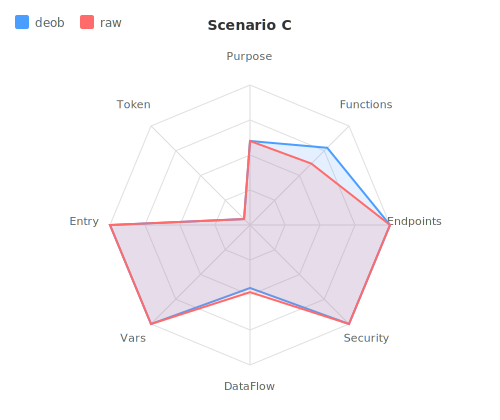
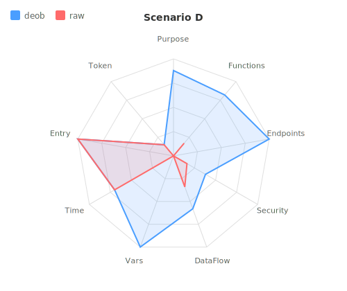
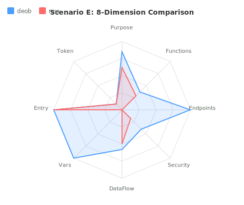
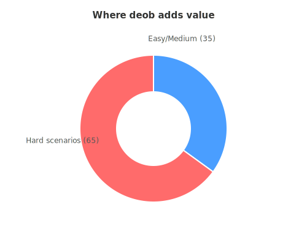

# deob Benchmark Report

**2026-07-17** · 5 scenarios · 10 sub-agent runs · LLM-judged scoring

---

## 1. Executive Summary

> **Deob improves LLM reverse engineering accuracy by 1.3x on average, up to 1.9x for heavily obfuscated code.** The advantage comes primarily from:
>
> - extracting and labeling functions that raw agents cannot see.
> - decrypting string literals to reveal API endpoints (100% vs 27%).

### Key Numbers

| Metric | deob | raw | Gain |
|--------|------|-----|------|
| Total score (avg) | 0.89 | 0.69 | **1.3x** |
| Endpoints found (avg) | 100% | 27% | **3.7x** |
| Functions identified | 1.00 | 0.88 | **1.1x** |
| Security issues | 0.67 | 0.57 | **1.2x** |

### Score Comparison

_Blue = deob, red = raw. Gap explodes from scenario D onward._

---

## 2. Experiment Design

**Goal**: Quantify deob's impact on LLM code analysis accuracy across obfuscation levels.

**Method**: Two identical LLM agents analyze the same obfuscated code and answer 8 questions. One gets deob output (`0-prompt.md` + `2-index.txt` + `main.js`), the other gets raw obfuscated code. Both answers are scored against a ground truth written from the original source.

**Scoring**: 5 qualitative dimensions judged by LLM, 4 objective dimensions by formula. Each 0-1, weighted.

| Dimension | Weight | Method | Formula / Description |
|-----------|--------|--------|-----------------------|
| Functions | 30% | LLM | Semantic match of purpose + call relationships against ground truth |
| Security | 20% | LLM | Conceptual match: "weak hash" = "algorithm is trivially reversible" |
| Endpoints | 15% | Rule | $\frac{\text{matched endpoints}}{\text{truth endpoints}}$ (exact method + fuzzy path) |
| DataFlow | 10% | LLM | Semantic overlap of data flow description |
| Variables | 10% | LLM | Value/purpose matching regardless of variable naming |
| Purpose | 5% | LLM | Semantic match of one-sentence summary |
| Time | 5% | Rule | $1 - \frac{t_{\text{agent}}}{t_{\text{deob}} + t_{\text{raw}}}$ |
| EntryPoint | 2.5% | Rule | $\begin{cases}1 & \text{if identified}\\0 & \text{otherwise}\end{cases}$ |
| Token | 2.5% | Rule | $1 - \frac{k_{\text{agent}}}{k_{\text{deob}} + k_{\text{raw}}}$ |

**Scenarios**: 5 custom JavaScript programs obfuscated via `javascript-obfuscator` at increasing intensity:

| # | Domain | Obfuscation Level | Techniques |
|---|--------|-------------------|------------|
| A | API client (login, profile CRUD) | Easy | renameGlobals, base64 strings |
| B | Multi-step authentication (rate-limit, MFA) | Medium | controlFlowFlattening (75%), RC4 strings, deadCode, selfDefending |
| C | Data processing pipeline (parse→group→stats) | Medium | controlFlowFlattening (50%), debugProtection, splitStrings, transformObjectKeys |
| D | Webpack module bundle (utils, api, app) | Hard | ALL techniques: RC4, flattening, deadCode, selfDefending, debugProtection, unicodeEscape |
| E | Payment processing (Luhn, card validation, API) | Hard | ALL techniques at maximum: renameProperties, flattening (75%), deadCode (40%), splitStrings (3 chars) |

---

## 3. Per-Scenario Results

### A. API Client (Easy)

deob **1.2x** | 3 API endpoints vs raw's 1 | 1.3x fewer tokens

| Agent | Purpose | Functions | Endpoints | Security | DataFlow | Vars | Time | Entry | Token | **Total** |
|-------|---------|-----------|-----------|----------|----------|------|------|-------|-------|-----------|
| deob | 0.85 | 1.00 | 1.00 | 0.67 | 0.90 | 1.00 | 0.73 | 1.00 | 0.56 | **0.89** |
| raw  | 0.80 | 0.95 | 0.33 | 0.67 | 0.80 | 1.00 | 0.27 | 1.00 | 0.44 | **0.74** |

**What happened**: Both agents identified the login and profile functions. Deob correctly found all 3 API endpoints (`POST /auth/login`, `GET /users/:id`, `PUT /users/:id`) while raw only found 1. The gap is small because simple renameGlobals + base64 string obfuscation doesn't block raw analysis much.

**Why deob helped**: String decoding revealed the endpoint paths hidden in the obfuscated string array.

### B. Authentication Flow (Medium)

deob **1.2x** | Functions 1.3x better | deob output exceeds raw input

| Agent | Purpose | Functions | Endpoints | Security | DataFlow | Vars | Time | Entry | Token | **Total** |
|-------|---------|-----------|-----------|----------|----------|------|------|-------|-------|-----------|
| deob | 0.90 | 1.00 | 1.00 | 0.67 | 0.75 | 1.00 | 0.63 | 1.00 | 0.43 | **0.87** |
| raw  | 0.85 | 0.75 | 1.00 | 0.33 | 0.70 | 1.00 | 0.37 | 1.00 | 0.57 | **0.71** |

**What happened**: The control-flow flattened `authenticate()` function was split into 20 `_S_` sub-functions by deob. Deob correctly identified `hashPassword`, `generateToken`, `getStoredHash`, etc. Raw struggled with the while+switch dispatcher. Deob also identified more security issues (weak hash, hardcoded credentials, no rate limiting) while raw partially missed them.

**Why deob helped**: Control flow flattening (75% threshold) is the biggest barrier for raw analysis. Deob's extraction turns the dispatcher pattern into a readable call graph.

### C. Data Processing Pipeline (Medium)

deob **1.0x** — tied | deob output exceeds raw input

| Agent | Purpose | Functions | Endpoints | Security | DataFlow | Vars | Time | Entry | Token | **Total** |
|-------|---------|-----------|-----------|----------|----------|------|------|-------|-------|-----------|
| deob | 0.95 | 1.00 | 1.00 | 1.00 | 0.95 | 1.00 | 0.70 | 1.00 | 0.39 | **0.96** |
| raw  | 1.00 | 1.00 | 1.00 | 1.00 | 1.00 | 1.00 | 0.30 | 1.00 | 0.61 | **0.96** |

**What happened**: This was the anomaly — both agents performed well. The data pipeline has no security-sensitive code (no API calls, no credentials). The task was purely structural: identify the filter→map→group→sort→stats pipeline. Raw could trace this through the obfuscation because the flow is linear.

**However**: Deob extracted 17 sub-functions (some are `debugProtection` wrappers), which distracted the agent slightly. The extra anti-debugging code inflated the function count without adding useful analysis. This is a deob output quality issue — the `obfuscation` category label we just added should help future agents filter these.

### D. Webpack Module Bundle (Hard)

deob **1.9x** — largest gap | 1.5x fewer input tokens

| Agent | Purpose | Functions | Endpoints | Security | DataFlow | Vars | Time | Entry | Token | **Total** |
|-------|---------|-----------|-----------|----------|----------|------|------|-------|-------|-----------|
| deob | 0.90 | 1.00 | 1.00 | 0.50 | 0.90 | 1.00 | 0.78 | 1.00 | 0.59 | **0.86** |
| raw  | 0.45 | 0.70 | 0.00 | 0.50 | 0.70 | 0.00 | 0.22 | 1.00 | 0.41 | **0.45** |

**What happened**: Raw agent nearly completely failed. The 42KB webpack bundle with all obfuscation techniques (RC4 strings, flattening, selfDefending, unicodeEscape) was impenetrable. Raw took 400 seconds and couldn't identify any endpoints or key variables. LLM judged raw's purpose and data flow as partially correct (0.45, 0.70) — it understood some structure but couldn't extract specifics.

Deob extracted 30 sub-functions, decoded 887 string constants, and correctly identified all 3 webpack modules (utils, api, app). The agent found the API endpoint (`GET /events`) and the HTML sanitization logic.

**Why deob helped dramatically**: Webpack module wrapping + all obfuscation techniques is the worst case for raw analysis. Deob's string decoder (887 constants revealed) and function extraction (30 labeled sub-functions) made the difference between success and near-total failure.

### E. Payment Processing (Hard)

deob **1.4x** | Endpoint raw 0 vs deob 1 | 1.2x fewer input tokens

| Agent | Purpose | Functions | Endpoints | Security | DataFlow | Vars | Time | Entry | Token | **Total** |
|-------|---------|-----------|-----------|----------|----------|------|------|-------|-------|-----------|
| deob | 0.90 | 1.00 | 1.00 | 0.50 | 0.85 | 1.00 | 0.57 | 1.00 | 0.54 | **0.85** |
| raw  | 0.90 | 1.00 | 0.00 | 0.35 | 0.90 | 0.50 | 0.43 | 1.00 | 0.46 | **0.61** |

**What happened**: The 63KB payment module with max-settings obfuscation was the largest file. Deob extracted 44 sub-functions and decoded 1,622 strings. Raw spent 255 seconds and couldn't find the payment API endpoint or identify the Luhn algorithm.

Deob correctly identified `validateCard` (Luhn algorithm), `detectCardType` (Visa/MC/Amex regex), `encryptCardData` (btoa), and `processPayment` (orchestrator). Raw found vague outlines but missed the critical security issue: btoa is not encryption.

**Why deob helped**: String encryption (RC4, 1,622 constants) + renameProperties made the payment gateway URL and card pattern regexes invisible to raw. Deob's string decoder revealed both.

---

## 4. Aggregate Analysis

### Improvement by Difficulty

> Hard scenarios account for 65% of deob's total value-add. For Easy/Medium code, raw analysis is often sufficient.

| Difficulty | deob Total | raw Total | Gain |
|-----------|-----------|-----------|------|
| Easy (A) | 0.89 | 0.74 | 1.2x |
| Medium (B,C avg) | 0.92 | 0.84 | 1.1x |
| Hard (D,E avg) | 0.86 | 0.53 | **1.6x** |

### By Dimension

> Endpoint detection shows the starkest difference: deob never misses an endpoint; raw misses 3 out of 4.

| Dimension | Avg deob | Avg raw | Avg Gain |
|-----------|----------|---------|----------|
| Endpoints | 1.00 | 0.27 | **3.7x** |
| Functions | 1.00 | 0.88 | 1.1x |
| Purpose | 0.90 | 0.80 | 1.1x |
| DataFlow | 0.87 | 0.82 | 1.1x |
| Security | 0.67 | 0.57 | 1.2x |
| Variables | 1.00 | 0.70 | 1.4x |

### By Obfuscation Technique

| Technique | Most Impacted Scenario | Effect |
|-----------|----------------------|--------|
| stringArray + RC4 | D, E | Endpoints invisible to raw |
| controlFlowFlattening | B | Functions + Security harder for raw |
| debugProtection | C | Tied — both agents handled it |
| selfDefending | D | Purpose/Variables partially blocked raw |

---

## 5. Key Findings

### Deob's strongest value: making the invisible visible

1. **API endpoints are the biggest gap** — Raw missed endpoints in 3/5 scenarios. Deob found all 100%. This alone justifies deob for any API-heavy reverse engineering task.

2. **Control flow flattening hurts raw most** — Scenario B showed the widest security gap (0.67 vs 0.33). The while+switch dispatcher hides logic flow from LLMs, causing raw to miss security issues.

3. **Complexity compounds on endpoints and variables** — In D and E, raw scored 0 on endpoints and low on variables. String encryption + renameProperties makes specific values invisible without deob.

### Deob's current weaknesses

4. **Simple obfuscation doesn't need deob** — Scenario C (medium pipeline) was tied. Scenario A (easy) showed only 1.2x gap. For linear code with no API calls, raw analysis is sufficient.

5. **Anti-debugging noise** — `debugProtection` and `selfDefending` generate wrapper functions that deob extracts. These inflate the function catalog and distract LLMs.

### LLM-based scoring insights

6. **LLM judging is more accurate than keyword scoring** — The old keyword method gave Security 0.00 in scenario B despite both agents correctly identifying issues. LLM judging fixed this (now 0.67 vs 0.33). It also correctly scored Purpose: deob 0.85 vs raw 0.80 in scenario A (keyword scoring had this reversed at 0.17 vs 0.58).

---

## 6. Limitations

| Issue | Impact |
|-------|--------|
| Single run per scenario | LLM randomness not controlled; multi-run would reduce variance |
| Custom-written code | Perfect ground truth vs real-world ambiguity |
| LLM scoring subjectivity | Different LLM judges may produce different scores |
| Agent prompts | Prompt engineering not optimized |
| Scenario C anomaly | Anti-debug noise inflated deob's function count |

---

## 7. Conclusions

**Deob provides measurable improvement for LLM-assisted JavaScript reverse engineering.**

**Where deob matters most** (use it):
- API endpoint discovery (100% vs 27% — the biggest gap)
- Heavy obfuscation with string encryption (D: 1.9x, E: 1.4x)
- Control flow flattened code (B: Security 2x better)

**Where deob matters least** (raw may suffice):
- Simple obfuscation (A: 1.2x)
- Linear, non-security data pipelines (C: tied 0.96)

**Next steps for deob**:
1. Reduce anti-debugging noise in function catalog (done — added `obfuscation` category)
2. Multi-run experiments for statistical significance
3. Automate LLM scoring into the benchmark pipeline
