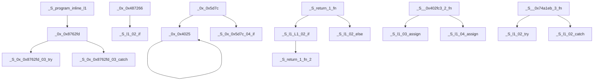

# main.js · Structure Report

> Previous: 0-prompt.md  →  **Now: 1-structure.md**  →  Next: 2-index.txt → jump to main.js
>
> 21 functions · (17 extracted sub-fns, 4 original) · 6 entry points

## Summary

| Metric | Value |
|--------|-------|
| Domain | General JS |
| Total functions | 21 |
| Sub-functions | 17 |
| Original functions | 4 |
| Max nesting depth | 5 |
| Max complexity | 6 |
| Flattened (susp.) | 0 |
| Suspicious patterns | 0 |
| Code density | 86% active code, 14% data/other |

## Hotspots

**Trace:** `_S_program_inline_l1` → `_0x_0x8762fd` → `_S_0x_0x8762fd_03_try`

| Rank | Type | Details |
|------|------|---------|
| 1 | Most-called | `_S_0x_0x8762fd_03_try` — called by 1 functions, calls 0 others |
| 2 | Most-called | `_0x_0x8762fd` — called by 1 functions, calls 2 others |
| 3 | Most-called | `_S_l1_L1_02_if` — called by 1 functions, calls 1 others |
| 4 | Most-called | `_S_l1_02_catch` — called by 1 functions, calls 0 others |
| 5 | Most-called | `_S_l1_02_if` — called by 1 functions, calls 0 others |
| 6 | Most-called | `_S_return_1_fn_2` — called by 1 functions, calls 0 others |
| 7 | Most-called | `_0x_0x4025` — called by 2 functions, calls 1 others |
| 8 | Most-called | `_S_l1_02_else` — called by 1 functions, calls 0 others |
| 9 | Most-called | `_S_l1_02_try` — called by 1 functions, calls 0 others |
| 10 | Most-called | `_S_0x_0x5d7c_04_if` — called by 1 functions, calls 0 others |
| — | Roots (6) | Entry points: `_0x_0x5d7c`, `_0x_0x487266`, `_S_program_inline_l1`, `_S_return_1_fn`, `_S__0x402fc3_2_fn`, `_S__0x74a1eb_3_fn` |
| — | Leaves (10) | Terminal functions: `_S_l1_02_else`, `_S_l1_02_try`, `_S_l1_02_catch`, `_S_0x_0x5d7c_04_if`, `_S_0x_0x8762fd_03_try`, `_S_0x_0x8762fd_03_catch`, `_S_l1_02_if`, `_S_l1_03_assign` … |

## String Alerts

_No significant patterns detected._

## Hot Groups

| Rank | Group | Edges |
|------|-------|-------|
| 1 | `top-level` | 17 |
| 2 | `l1` | 6 |
| 3 | `l1_L1` | 2 |
| 4 | `0x_0x8762fd` | 2 |
| 5 | `0x_0x5d7c` | 1 |

## Call Graph

## Naming Convention

All sub-functions follow the format: `_S_<parent>_<seq>_<hint>`

| Component | Meaning |
|-----------|---------|
| `_S_` | Prefix indicating an extracted sub-function |
| `<parent>` | The parent function name, object method name, or line number (`lXXXX`) for anonymous functions |
| `<seq>` | Two-digit sequence number indicating extraction order within the parent |
| `<hint>` | Short hint about the extracted code structure |
| `_L<line>` | (Collision only) Source line number appended when name would otherwise collide |

### Examples

| Name | Meaning |
|------|---------|
| `_S_0x28bed7_01_try` | Extracted from function 0x28bed7, seq 01, try body |
| `_S_constructor_07_if` | Extracted from method 'constructor', seq 07, if branch |
| `_S_l100877_03_try` | Anonymous parent at line 100877, seq 03, try body |
| `_S_program_init_vars_l1149` | Top-level program IIFE at line 1149, variable initialization |
| `_S_return_1_fn` | Inline function lifted from a return statement |
| `_S_l251_L1364_01_try vs _S_l251_L1548_01_try` | Two try blocks with same parent+seq+hint — _L<line> disambiguates by source line |

### Hint Descriptions

| Hint | Meaning |
|------|---------|
| `try` | try block body |
| `catch` | catch handler |
| `if` | if branch |
| `else` | else branch |
| `case` | switch case body |
| `iife_body` | IIFE body |
| `init_vars` | variable initialization |
| `declare_fn` | function declarations |
| `return_val` | return value expression |
| `body` | loop body or block |
| `block` | general code block |

---
Generated by deob · 2026-07-16
