# main.js · Structure Report

> Previous: 0-prompt.md  →  **Now: 1-structure.md**  →  Next: 2-index.txt → jump to main.js
>
> 51 functions · (44 extracted sub-fns, 7 original) · 1 flattened (while+switch) · 11 entry points

## Summary

| Metric | Value |
|--------|-------|
| Domain | General JS |
| Total functions | 51 |
| Sub-functions | 44 |
| Original functions | 7 |
| Max nesting depth | 5 |
| Max complexity | 10 |
| Flattened (susp.) | 1 |
| Suspicious patterns | 0 |
| Code density | 78% active code, 22% data/other |

## Hotspots

**Trace:** `_0x_0xfe6a92` → `_S_0x_0xfe6a92_04_branch` → `_S_return_8_fn`

| Rank | Type | Details |
|------|------|---------|
| 1 | Most-called | `_S_0x1819b9_04_if` — called by 1 functions, calls 1 others |
| 2 | Most-called | `_S_l1_02_try` — called by 1 functions, calls 0 others |
| 3 | Most-called | `_S_l1_02_catch` — called by 1 functions, calls 0 others |
| 4 | Most-called | `_S_l1_02_if_2` — called by 1 functions, calls 1 others |
| 5 | Most-called | `_S_l1_L1_02_else` — called by 1 functions, calls 1 others |
| 6 | Most-called | `_S_l1_L1_04_if` — called by 1 functions, calls 1 others |
| 7 | Most-called | `_S_0x_0x4177_06_if` — called by 1 functions, calls 0 others |
| 8 | Most-called | `_S_0x_0x5673c_04_try` — called by 1 functions, calls 1 others |
| 9 | Most-called | `_S_0x_0x887c1d_03_try` — called by 1 functions, calls 0 others |
| 10 | Most-called | `_S_0x_0xfe6a92_04_branch` — called by 1 functions, calls 1 others |
| — | Roots (11) | Entry points: `_0x_0x4177`, `_0x_0xfe6a92`, `_0x_0x5673c`, `_0x_0x887c1d`, `_S_program_inline_l1`, `_S_return_1_fn`, `_S_return_2_fn`, `_S_return_3_fn` … |
| — | Leaves (27) | Terminal functions: `_S_l1_02_try`, `_S_l1_02_catch`, `_S_l1_02_else_2`, `_S_l1_04_else_2`, `_S_l1_L1_02_if`, `_S_0x1819b9_04_else`, `_S_0x_0x4177_04_if`, `_S_0x_0x4177_06_if` … |

## String Alerts

_No significant patterns detected._

## Hot Groups

| Rank | Group | Edges |
|------|-------|-------|
| 1 | `top-level` | 39 |
| 2 | `l1` | 10 |
| 3 | `l1_L1` | 6 |
| 4 | `0x_0x5673c` | 4 |
| 5 | `0x1819b9` | 3 |
| 6 | `0x_0x4177` | 3 |
| 7 | `0x_0xfe6a92` | 3 |
| 8 | `0x_0x887c1d` | 2 |

## Call Graph

```mermaid
graph TD
  _0x_0x4177 --> _0x_0x2352
  _0x_0x4177 --> _S_0x_0x4177_04_if
  _0x_0x4177 --> _S_0x_0x4177_06_if
  _0x_0x4177 --> _S_0x_0x4177_06_else
  _0x_0xfe6a92 --> _S_0x_0xfe6a92_02_if
  _0x_0xfe6a92 --> _S_0x_0xfe6a92_04_branch
  _0x_0x5673c --> _S_0x_0x5673c_02_if
  _0x_0x5673c --> _S_0x_0x5673c_04_try
  _0x_0x5673c --> _S_0x_0x5673c_04_catch
  _0x_0x887c1d --> _S_0x1819b9_04_if
  _0x_0x887c1d --> _S_0x1819b9_04_else
  _0x_0x887c1d --> _S_0x_0x887c1d_03_try
  _0x_0x887c1d --> _S_0x_0x887c1d_03_catch
  _S_l1_02_if_2 --> _S_return_1_fn_2
  _S_l1_L1_02_else --> _S_return_2_fn_2
  _S_l1_L1_04_if --> _S_return_3_fn_2
  _S_program_inline_l1 --> _S_return_4_fn
  _S_program_inline_l1 --> _S_return_5_fn_2
  _S_return_1_fn --> _S_l1_L1_04_if
  _S_return_1_fn --> _S_l1_04_else_2
  _S_return_2_fn --> _S_l1_02_if_2
  _S_return_2_fn --> _S_l1_02_else_2
  _S_return_3_fn --> _S_l1_L1_02_if
  _S_return_3_fn --> _S_l1_L1_02_else
  _S__0x3598a3_3_fn --> _S_l1_02_try
  _S__0x3598a3_3_fn --> _S_l1_02_catch
  _S__0x5c84ee_5_fn --> _S_l1_03_assign
  _S__0x5c84ee_5_fn --> _S_l1_L1_04_assign
  _S__0x5a89d4_6_fn --> _S_l1_04_assign
  _S__0x5a89d4_6_fn --> _S_l1_05_block
  _S__0x5a89d4_6_fn --> _S_l1_07_block
  _S_0x1819b9_04_if --> _S_return_6_fn
  _S_0x_0x5673c_04_try --> _S_return_7_fn
  _S_0x_0xfe6a92_04_branch --> _S_return_8_fn
  _0x_0x2352 --> _0x_0x2352
```

## Naming Convention

All sub-functions follow the format: `_S_<parent>_<seq>_<hint>`

| Component | Meaning |
|-----------|---------|
| `_S_` | Prefix indicating an extracted sub-function |
| `<parent>` | The parent function name, object method name, or line number (`lXXXX`) for anonymous functions |
| `<seq>` | Two-digit sequence number indicating extraction order within the parent |
| `<hint>` | Short hint about the extracted code structure |
| `_L<line>` | (Collision only) Source line number appended when name would otherwise collide |

### Examples

| Name | Meaning |
|------|---------|
| `_S_0x28bed7_01_try` | Extracted from function 0x28bed7, seq 01, try body |
| `_S_constructor_07_if` | Extracted from method 'constructor', seq 07, if branch |
| `_S_l100877_03_try` | Anonymous parent at line 100877, seq 03, try body |
| `_S_program_init_vars_l1149` | Top-level program IIFE at line 1149, variable initialization |
| `_S_return_1_fn` | Inline function lifted from a return statement |
| `_S_l251_L1364_01_try vs _S_l251_L1548_01_try` | Two try blocks with same parent+seq+hint — _L<line> disambiguates by source line |

### Hint Descriptions

| Hint | Meaning |
|------|---------|
| `try` | try block body |
| `catch` | catch handler |
| `if` | if branch |
| `else` | else branch |
| `case` | switch case body |
| `iife_body` | IIFE body |
| `init_vars` | variable initialization |
| `declare_fn` | function declarations |
| `return_val` | return value expression |
| `body` | loop body or block |
| `block` | general code block |

---
Generated by deob · 2026-07-16
