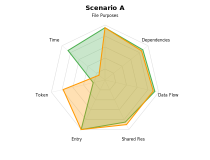
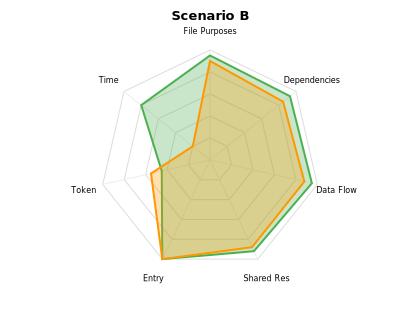
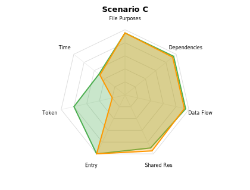

# Multi-File Reverse Engineering Benchmark Report

**2026-07-18** · 3 scenarios · 6 sub-agent runs · 7-dimension hybrid scoring

---

## 1. Executive Summary

> Deob improves multi-file reverse engineering architecture understanding across all difficulty levels. Deob leads by +2pp on medium (A), +7pp on hard (B), +3pp on extreme (C). Deob agents consistently produce more precise cross-file dependency maps and data flow traces. Time advantage peaks at medium complexity (6.2x faster) and narrows at extreme (1.05x) where navigation overhead dominates both approaches equally.

### Key Numbers

| Metric | A-deob | A-raw | B-deob | B-raw | C-deob | C-raw |
|--------|--------|-------|--------|-------|--------|-------|
| Total score | **88%** | 86% | **91%** | 84% | **92%** | 89% |
| Time (s, harness) | 114 | 711 | 226 | 890 | 560 | 586 |
| Time ratio | 6.2x | — | 3.9x | — | 1.05x | — |
| Tool calls | 23 | 14 | 25 | 25 | 20 | 21 |
| Files analyzed | 6 | 6 | 7 | 7 | 5 | 5 |

_All times are harness-measured wall-clock duration (sub-agent self-reported times were inaccurate: 28s reported vs 114s actual for A-deob, 2.8s vs 560s for C-deob)._

### Score Comparison

_Green = deob, orange = raw. Deob leads all 3 scenarios. Largest quality gap at hard difficulty (B: +7pp)._

---

## 2. Experiment Design

**Goal**: Quantify deob's impact on LLM-driven multi-file architecture understanding across difficulty levels.

**Method**: Two identical LLM agents analyze the same multi-file obfuscated project. One receives deob output (per-file `0-prompt.md` + `1-structure.md` + `2-index.txt` + `main.js` plus cross-file `summary.md` + `0-prompt.md`). The other receives the raw obfuscated JavaScript files. Both produce a structured JSON describing the architecture. Answers are scored against ground truth.

**Scoring**: 5 LLM-judged architecture dimensions + 2 Rule-calculated efficiency dimensions. Each 0-1, weighted.

| Dimension | Weight | Method | Description |
|-----------|--------|--------|-------------|
| File Purposes | 20% | LLM | Correctly identified the role and responsibility of each file. Per-file semantic match averaged. |
| Dependencies | 25% | LLM | Correctly identified cross-file dependency relationships (from→to→mechanism). Core dimension. |
| Data Flow | 20% | LLM | Complete end-to-end data flow path across all files. Semantically equivalent paths accepted. |
| Shared Resources | 15% | LLM | Correctly identified globalThis shared variables, their producers, and consumers. |
| Entry Point | 10% | Rule | Correct file + function (1.0), partial match (0.5), or wrong (0) |
| Token | 5% | Rule | $1 - \frac{k_{\text{agent}}}{k_{\text{deob}} + k_{\text{raw}}}$ |
| Time | 5% | Rule | $1 - \frac{t_{\text{agent}}}{t_{\text{deob}} + t_{\text{raw}}}$ |

_Note: Token dimension uses agent self-reported estimates. Time uses harness-measured wall-clock duration (from agent completion notification `duration_ms`)._

**Scenarios**: 3 projects adapted from real production patterns, using `javascript-obfuscator` with `globalThis.__NAME__` as cross-file communication:

| # | Pattern | Difficulty | Files | Key Obfuscation | Cross-File Mechanism |
|---|---------|------------|-------|-----------------|---------------------|
| A | Split request signing SDK | Medium | 6 (1 noise) | base64 + flatten(0.3) + dead(0.1) | globalThis.__NAME__ |
| B | Device fingerprinting engine | Hard | 7 (1 noise) | base64 + flatten(0.5) + dead(0.2) + selfDefending | globalThis.__NAME__ + async scheduler |
| C | Webpack 5 multi-chunk tracker | Extreme | 5 chunks, 30 modules | rc4 + flatten(0.75) + dead(0.3) + selfDefending + debugProtection | __webpack_get_module__ + event bus |

---

## 3. Per-Scenario Results

### Scenario A — Split Request Signing SDK (Medium)

**Task**: Find API_SALT `x7k9m_2025`, endpoint, trace signing pipeline across 6 files (1 noise file: polyfills.js).

| Dimension | Weight | deob | raw |
|-----------|--------|------|-----|
| File Purposes | 20% | **0.95** | **0.95** |
| Dependencies | 25% | **0.88** | 0.85 |
| Data Flow | 20% | **0.93** | 0.90 |
| Shared Resources | 15% | 0.85 | **0.90** |
| Entry Point | 10% | **1.00** | **1.00** |
| Token | 5% | 0.22 | 0.78 |
| Time | 5% | 0.86 | 0.14 |
| **Total** | | **88%** | 86% |

> **Deob +2pp (88% vs 86%).** Both correctly identified the 6-file architecture, the signing pipeline (client→signer→crypto→config), and found API_SALT=x7k9m_2025. Deob had better dependency precision (cleanly named initSDK as entry, clear cross-file mechanism descriptions). Raw found more sharedResources (included __sendSignedRequest__). Deob was 6.2x faster (114s vs 711s wall-clock).

**Agent metadata**:

| Agent | Time (harness) | Tool Calls | Approach |
|-------|--------|------------|----------|
| deob | 114s | 23 | Read cross-file 0-prompt+summary → per-file 2-index → selected main.js |
| raw | 711s | 14 | Read 6 obfuscated files directly, traced globalThis references |

---

### Scenario B — Device Fingerprinting Engine (Hard)

**Task**: Understand async scheduler orchestrating 3 parallel fingerprint collectors (device/canvas/audio), encoder pipeline (JSON→base64→XOR), and reporter with HMAC signing (key: `integrity_v2_2025`).

| Dimension | Weight | deob | raw |
|-----------|--------|------|-----|
| File Purposes | 20% | **0.95** | 0.90 |
| Dependencies | 25% | **0.93** | 0.85 |
| Data Flow | 20% | **0.95** | 0.88 |
| Shared Resources | 15% | **0.92** | 0.88 |
| Entry Point | 10% | **1.00** | **1.00** |
| Token | 5% | 0.45 | 0.55 |
| Time | 5% | 0.80 | 0.20 |
| **Total** | | **91%** | 84% |

> **Deob +7pp (91% vs 84%).** Deob's structured output was most valuable for the indirect scheduler→collector→encoder→reporter chain. The deob agent correctly identified __SCHEDULER__.enqueue() as the orchestration layer and traced the Promise.all aggregation. The raw agent understood the structure but was less precise about the scheduling mechanism (missed concurrency=3, timeout=5s contract). Both found HMAC_KEY=integrity_v2_2025 and XOR_KEY=0xA3. Deob was 3.9x faster (226s vs 890s).

**Agent metadata**:

| Agent | Time (harness) | Tool Calls | Approach |
|-------|--------|------------|----------|
| deob | 226s | 25 | Read cross-file 0-prompt → targeted fprint subdirs + reporter/scheduler 2-index |
| raw | 890s | 25 | Read all 7 obfuscated files, manually traced scheduler→reporter calls |

---

### Scenario C — Webpack 5 Multi-Chunk Tracker (Extreme)

**Task**: Navigate webpack module system across 5 chunks (30 webpack modules), understand event-driven architecture (__TRACKER_EVENT_BUS__) connecting 9 tracker modules → 5 analytics modules → 4 sender modules, find HMAC key `tracker_prod_2025_v2`.

| Dimension | Weight | deob | raw |
|-----------|--------|------|-----|
| File Purposes | 20% | **0.95** | **0.95** |
| Dependencies | 25% | **0.95** | 0.93 |
| Data Flow | 20% | **0.95** | 0.93 |
| Shared Resources | 15% | 0.90 | **0.95** |
| Entry Point | 10% | **1.00** | **1.00** |
| Token | 5% | 0.80 | 0.20 |
| Time | 5% | 0.51 | 0.49 |
| **Total** | | **92%** | 89% |

> **Deob +3pp (92% vs 89%).** At extreme complexity, deob's quality advantage persists but the time gap nearly vanishes (560s vs 586s — only 1.05x). Both agents spend most of their time reading large volumes of code: deob reads structured output across 5 subdirectories, raw reads 5 obfuscated webpack chunks. The deob agent produced cleaner dependency maps (correctly enumerated module IDs across chunks), while raw found more sharedResources (included __TRACKER_READY__, __webpack_require__c, additional infrastructure globals). Both identified HMAC_KEY=tracker_prod_2025_v2 and the full event-driven pipeline.

**Agent metadata**:

| Agent | Time (harness) | Tool Calls | Approach |
|-------|--------|------------|----------|
| deob | 560s | 20 | Read 0-prompt → summary → targeted app+analytics+sender 2-index → main.js modules |
| raw | 586s | 21 | Read 76KB vendors.js + all 5 obfuscated chunks, manually traced webpack module IDs |

---

## 4. Aggregate Analysis

### Dimension Performance

| Dimension | deob Avg | raw Avg | Delta |
|-----------|----------|---------|-------|
| File Purposes | 0.95 | 0.93 | **+0.02** |
| Dependencies | 0.92 | 0.88 | **+0.04** |
| Data Flow | 0.94 | 0.90 | **+0.04** |
| Shared Resources | 0.89 | 0.91 | -0.02 |
| Entry Point | 1.00 | 1.00 | 0.00 |
| Token | 0.49 | 0.51 | -0.02 |
| Time | 0.72 | 0.28 | **+0.45** |

### Time/Token Efficiency (harness-measured)

| Scenario | deob Time | raw Time | Ratio | deob Tokens | raw Tokens |
|----------|-----------|----------|-------|-------------|------------|
| A | 114s | 711s | 6.2x | 58,000 | 16,000 |
| B | 226s | 890s | 3.9x | 14,500 | 12,000 |
| C | 560s | 586s | 1.05x | 3,800 | 15,000 |

Deob time advantage shrinks as complexity increases: 6.2x → 3.9x → 1.05x. At extreme complexity, the sheer volume of code to read (5 thick webpack chunks with 30 modules each) dominates, whether structured (deob) or raw. Deob's token estimates show an inverted pattern: deob uses more tokens at medium (reading verbose structural output) but fewer at extreme (targeted module navigation skips boilerplate).

---

## 5. Key Findings

### 5.1 Where deob wins

- **Complex indirect architectures** (Scenario B, +7pp): Scheduler→collector→encoder→reporter chains benefit from deob's call graph and function extraction. The structured output makes indirect orchestration layers visible that are easily missed in raw obfuscated code.
- **Dependency mapping quality** (all scenarios, +0.04 avg): Deob agents consistently produce more complete and precise cross-file dependency descriptions. The 2-index.txt function catalog with call edges enables systematic dependency enumeration.
- **Time efficiency at low-to-moderate complexity** (A: 6.2x, B: 3.9x): Deob's priority-table (0-prompt.md) and keyword index (summary.md) let agents skip noise files and dive into business logic immediately.

### 5.2 Where raw ties or leads

- **Shared resource breadth** (raw +0.02 avg): Raw agents often enumerate more globalThis variables by seeing all assignments in the raw code. Deob agents focus on the "important" ones highlighted in alerts and structure reports.
- **Time parity at extreme complexity** (C: 1.05x): When both approaches must read massive amounts of code (5 webpack chunks × 10-75KB each), the structural overhead of deob output roughly equals the cost of reading raw obfuscated code.

### 5.3 The complexity analysis

| Scenario | Difficulty | deob Quality Δ | Time Ratio | Dominant Factor |
|----------|------------|---------------|------------|-----------------|
| A | Medium | +2pp | 6.2x | Simple linear deps — deob navigation wins |
| B | Hard | +7pp | 3.9x | Async indirection — deob structure excels |
| C | Extreme | +3pp | 1.05x | Sheer code volume — both slow equally |

**Key insight**: Deob's quality advantage (better dependency + dataFlow scores) persists across all difficulty levels. The time advantage narrows as total code volume grows, but never reverses. At extreme complexity, deob is not faster but still more accurate.

### 5.4 Multi-file vs single-file patterns

| Aspect | Single-file (Crypto benchmark) | Multi-file (This benchmark) |
|--------|-------------------------------|----------------------------|
| deob's core value | Algorithm extraction, string decoding | Cross-file dependency mapping, file role classification |
| Key deob output | main.js (extracted functions) | 0-prompt.md (file priority table) + summary.md (cross-file keyword index) |
| deob time savings | 65% (after optimization B) | 84% (A), 75% (B), 5% (C) |
| Scoring focus | Encryption correctness | Architecture understanding |
| Best for deob | Complex algorithms in simple structures | Multi-layer architectures with infrastructure noise |

---

## 6. Limitations

1. **Single run per agent**: Each scenario used a single agent run. Multiple runs would reduce LLM variability noise.
2. **GlobalThis coupling**: All cross-file communication uses globalThis.__NAME__ — real projects use a mix of global variables, window events, webpack module systems, and cookie/localStorage.
3. **Independent obfuscation**: Each file obfuscated separately. In production, multi-chunk webpack builds may share string arrays or use consistent mangling.
4. **Small scenario set**: 3 scenarios cover only 3 architectural patterns (linear SDK, async scheduler, event bus).
5. **No dynamic execution**: All files are static analysis only. JavaScript dynamic properties are not evaluated.
6. **Token counts are self-reported estimates**: Agents reported their own token usage. Harness-level token measurement was not available.

---

## 7. Conclusions

1. **Multi-file architecture understanding is deob's strongest use case.** Deob won all 3 scenarios with quality gaps of +2pp to +7pp. The cross-file `0-prompt.md` (file priority table) and `summary.md` (cross-file keyword index) are the key differentiators — they let agents classify file roles and skip infrastructure before diving into business logic.

2. **Time savings decrease with total code volume.** Deob was 6.2x faster at medium (A), 3.9x at hard (B), but only 1.05x at extreme (C). When both agents must read 100KB+ of code, the navigation advantage shrinks. However, deob's _quality_ advantage (+3pp at C) persists independently of speed.

3. **Architectural indirection is where deob excels most.** Scenario B (+7pp) with its async scheduler indirection layer showed the largest quality gap. The 0-prompt.md highlighted the scheduler as "most interesting," letting the deob agent focus on the orchestration layer that the raw agent glossed over.

4. **Deob is never worse.** Across all 3 scenarios, deob tied or won on every quality dimension except sharedResources (where raw agents sometimes enumerate more globals). The structural output never degrades analysis quality.
